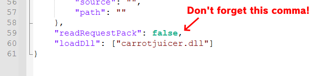
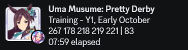
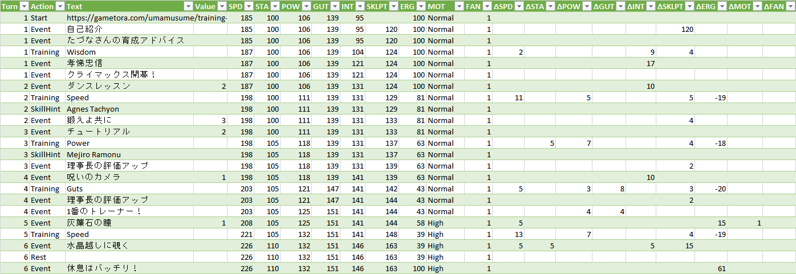
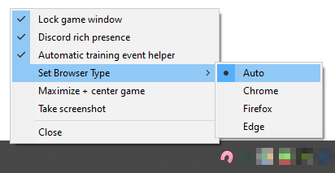

# Uma Launcher
Software that enhances the Uma Musume (DMM Version) experience.

For questions and feedback, join the Discord server:

## Requirements (Optional but recommended)
- [EXNOA-CarrotJuicer](https://github.com/CNA-Bld/EXNOA-CarrotJuicer)
  - Download the latest version: 
  - Make sure CarrotJuicer's `version.dll` is located in the same directory as `umamusume.exe`.
  - While optional, CarrotJuicer allows Uma Launcher to extract information from the network packets the game sends/receives. This information is necessary to determine the current status of the game, and needed for most of the features of Uma Launcher to work.

## Download
First, read the requirements above. Then download the latest version:

## Usage
Download the latest release's `UmaLauncher.exe` and run it. Right-click the horseshoe icon in the system tray to change the settings or close Uma Launcher.

On first launch or when you change the game's location, you may be asked to select the installation location for the game if you are not using the default location.

When a new version of Uma Launcher is available, you will be notified on startup. You may choose to update, or postpone the update temporarily or permanently.

## Usage with Trainers' Legend G
If you want to use all features of Uma Launcher together with [Trainers' Legend G](https://github.com/MinamiChiwa/Trainers-Legend-G) (or the [English translation project](https://github.com/noccu/umamusu-translate)), you can do so by adding CarrotJuicer to TLG's config.json file. Follow these steps:

1. Rename CarrotJuicer's `version.dll` to something else, e.g. `carrotjuicer.dll`.
2. Copy the renamed `carrotjuicer.dll` to the same directory as `umamusume.exe`.
3. Install TLG and/or the English translation project as normal.
4. Add `"carrotjuicer.dll"` to the `loadDll` array in TLG's `config.json` file. If using using the English translation project, you will need to manually add the `loadDll` array to the config file. **Make sure the line before `loadDll` ends in a comma if you add it to the end of the file! See the image below for an example.**

*An example of the config.json file with carrotjuicer.dll added to loadDll.*

## Features
### Launch Uma Musume simply by running one file
- The program automatically launches the game through DMM and closes it without needing any extra interaction.
  - Exceptions are: Logging into DMM and confirming game updates.
- The script will ask for administrator privileges to interact with the Uma Musume window.
### Better Discord rich presence for Uma Musume

*An example of the training rich presence during training.*
- Shows which home screen you're on.
- Shows training and concert details extracted from the game's packets. **(CarrotJuicer required)**
- (Still work-in-progress.)
### Automatic GameTora training event helper
**(CarrotJuicer required)**

*An example of the automatic training event helper scrolling to the training event.*
- Automatically start a browser window with the current trained character and support cards.
- Automatically selects and scrolls to event choices when needed.
- Displays a useful table of the current training facilities' details.
- Supports Edge, Chrome and Firefox browsers.
### Inspect your training runs
**(CarrotJuicer required)**

*An example of a training run CSV, imported into Excel. (Only a subset of columns is shown.)*
- With the 'Track trainings' setting enabled, your training runs will be saved as a gzip file in the `training_logs` folder. This folder will be automatically created next to the exe.
- Use the 'Export Training CSV' option in the tray icon menu to export the training logs to a CSV file.
- CSVs can be generated without launching the exe by dragging and dropping logs from the `training_logs` folder onto the exe.
- (Documentation for the CSV format will be added later.)
### Quality-of-life features

*An image showing the different settings in the tray icon.*
- Various options to enable/disable during gameplay by right-clicking the horse shoe icon in the system tray/taskbar:
  - Locking and remembering the game window position for portrait and landscape mode separately.
    - This also includes the automatic training event helper.
  - Automatically resizing the game to the largest possible size on your screen.
  - Take screenshots.

## Disclaimer
Uma Launcher is in no way associated with Uma Musume, Cygames or DMM.  
It is the developer's belief that this tool is harmless to the above companies and brands and merely acts as a tool to improve the user experience.  

## License
  
This code is available under the GNU GPLv3 license.

## Credits
Credits for included libraries can be found in the [credits file](CREDITS.txt).
